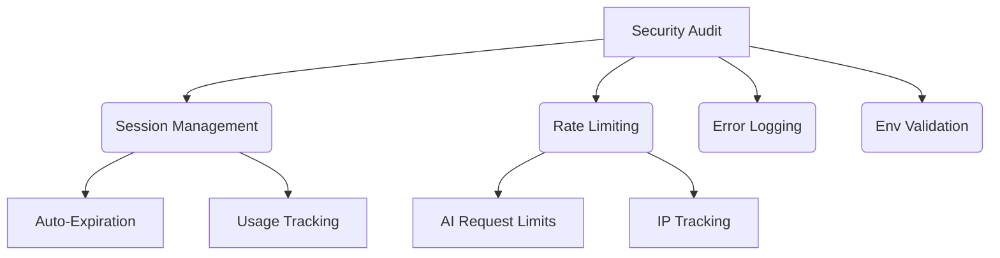

# CyberSentinel - AI-Powered Threat Detection

[](https://github.com/dtFro/CyberSentinel/actions)
[](https://github.com/dtFro/CyberSentinel/actions)
[](https://www.typescriptlang.org/)

## About

CyberSentinel is a secure session management and AI integration platform built with TypeScript and clean architecture principles. It provides robust security features, rate limiting, and comprehensive error handling.

## Features

- 🔐 **Secure Session Management**: Automatic expiration and validation
- 🛡️ **Rate Limiting**: Prevent API abuse with configurable rate limits
- 🧪 **Comprehensive Testing**: Unit and integration tests for all components
- 🚀 **CI/CD Pipeline**: Automated quality gates and security checks
- 🔍 **Security Monitoring**: Daily automated security audits
- 🧩 **Clean Architecture**: Modular design with separation of concerns
- Real-time AI threat detection
- Automated security auditing
- CI/CD with quality gates
- Session management with auto-expiration
- Rate limiting protection

## Getting Started

```bash
# Clone the repository
git clone https://github.com/dfrostar/CyberSentinel.git

# Install dependencies
npm install

# Run development server
npm run dev

# Run tests
npm test

# Run security audit
npm run security:audit
```

## Documentation

- [Architecture Overview](./docs/ARCHITECTURE.md)
- [Development Standards](./docs/DEVELOPMENT_STANDARDS.md)
- [MCP Operations Manual](docs/MCP-OPERATIONS.md)

## Security

Security is a top priority for CyberSentinel. We implement:

- Automated security scanning
- Strict input validation
- Session expiration controls
- Environment variable protection
- GPG-signed commits

### Security Implementation


Report security issues to security@example.com.

## License

MIT
