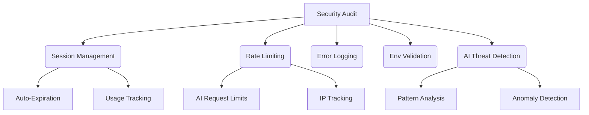

# CyberSentinel - AI-Powered Threat Detection

[](https://github.com/dtFro/CyberSentinel/actions)
[](https://github.com/dtFro/CyberSentinel/actions)
[](https://www.typescriptlang.org/)

## About

CyberSentinel is a secure session management and AI integration platform built with TypeScript and clean architecture principles. It provides robust security features, rate limiting, and comprehensive error handling.

## Features

- 🔐 **Secure Session Management**: Automatic expiration and validation
- 🛡️ **Rate Limiting**: Prevent API abuse with configurable rate limits
- 🧪 **Comprehensive Testing**: Unit and integration tests for all components
- 🚀 **CI/CD Pipeline**: Automated quality gates and security checks
- 🔍 **Security Monitoring**: Daily automated security audits
- 🧩 **Clean Architecture**: Modular design with separation of concerns
- 🤖 **AI Integration**: Real-time threat detection with advanced ML models
- 📊 **State Management**: Zustand for client state, React Query for server state
- 📝 **TypeScript**: Full type safety throughout the codebase
- 🔄 **Error Boundaries**: Graceful failure handling and recovery mechanisms

## Getting Started

```bash
# Clone the repository
git clone https://github.com/dfrostar/CyberSentinel.git

# Install dependencies
npm install

# Run development server
npm run dev

# Run tests
npm test

# Run security audit
npm run security:audit
```

## Documentation

CyberSentinel is extensively documented in our [GitHub Wiki](https://github.com/dfrostar/CyberSentinel/wiki), which includes:

- [Project Overview and Features](https://github.com/dfrostar/CyberSentinel/wiki)
- [Development Standards](https://github.com/dfrostar/CyberSentinel/wiki/Development-Standards)
- [Security Implementation](https://github.com/dfrostar/CyberSentinel/wiki/Security-Implementation)
- [API Documentation](https://github.com/dfrostar/CyberSentinel/wiki/API-Documentation)
- [Troubleshooting Guide](https://github.com/dfrostar/CyberSentinel/wiki/Troubleshooting)
- [MCP Operations Manual](https://github.com/dfrostar/CyberSentinel/wiki/MCP-OPERATIONS)

Local documentation:
- [Architecture Overview](./docs/ARCHITECTURE.md)
- [Development Standards](./docs/DEVELOPMENT_STANDARDS.md)
- [MCP Operations Manual](docs/MCP-OPERATIONS.md)

## AI Integration

CyberSentinel leverages advanced AI models for threat detection and security analysis:

- **Real-time Monitoring**: AI-powered analysis of system activities
- **Anomaly Detection**: Identification of unusual patterns and potential security threats
- **Contextual Analysis**: Understanding of user behavior in context
- **Adaptive Security**: Learning from new threat patterns to improve detection

Our AI implementation follows strict guidelines for performance, ethics, and privacy. All AI features include graceful fallbacks and proper error handling to ensure system stability.

## Security

Security is a top priority for CyberSentinel. We implement:

- Automated security scanning
- Strict input validation
- Session expiration controls
- Environment variable protection
- GPG-signed commits
- Rate limiting and IP tracking
- AI-powered threat detection

### Security Implementation


Report security issues to security@example.com.

## License

MIT
