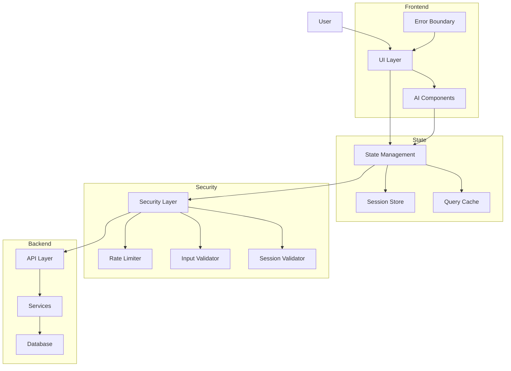
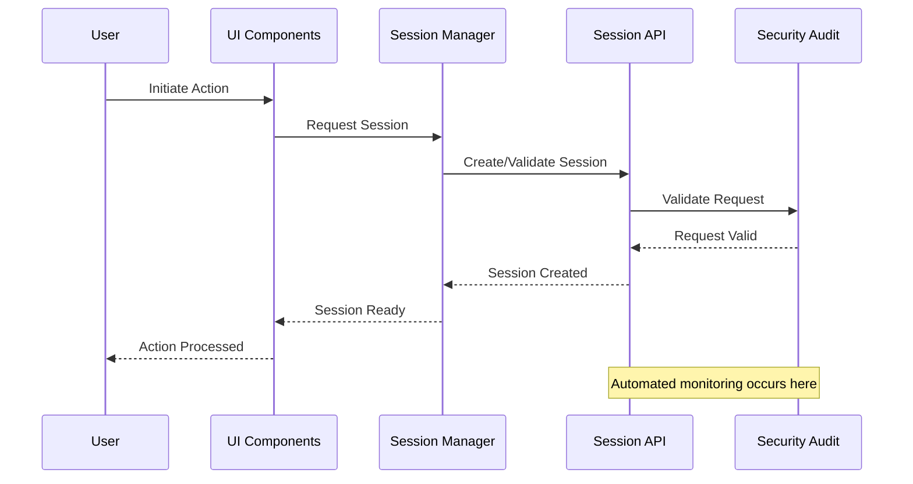

# CyberSentinel Architecture

## System Overview

## Component Interactions

### Session Management Flow

## Security Architecture

The security architecture follows a layered approach:

1. **Input Validation**: All user inputs and API responses are validated
2. **Rate Limiting**: Prevents abuse of AI endpoints and ensures fair usage
3. **Session Management**: Secure session creation, validation, and expiration
4. **Error Boundaries**: Graceful handling of failures with appropriate user feedback
5. **Automated Monitoring**: Continuous scanning and audit of the application

## Clean Architecture Implementation

CyberSentinel follows clean architecture principles with clear separation of concerns:

- **Entities**: Core business objects
- **Use Cases**: Application-specific business rules
- **Interface Adapters**: Presenters and controllers
- **Frameworks**: UI, database, web, etc.

This ensures that:
1. The system is testable
2. UI can change without affecting business rules
3. Business rules can change without affecting UI
4. Database can be replaced without affecting business rules
5. Any external agency can be replaced
